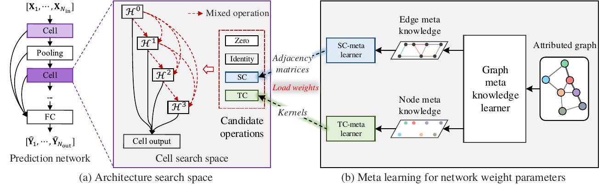

# AutoSTG: Neural Architecture Search forPredictions of Spatio-Temporal Graph



This is the PyTorch implementation of AutoSTG.

---

## Requirements for Reproducibility

### System Requirements:
- System: CentOS 7 (Linux Kernel: 4.18.9)
- Language: Python 3.7.7
- Devices: a single Tesla V100 GPU

### Library Requirements:
- numpy == 1.19.1
- pandas == 1.1.1
- torch ==1.6.0
- torchvision ==0.7.0
- tables == 3.6.1
- ruamel.yaml == 0.16.12

---
## Data Preparation
Unzip [dataset/dataset.zip](dataset/dataset.zip) with the following command:
```
cd dataset
unzip ./dataset.zip
```


## Description of Traffic Data

The description please refers to the repository of [DCRNN](https://github.com/liyaguang/DCRNN).

---

## Model Training & Testing

[src/run_on_gpu0.sh](src/run_on_gpu0.sh) given an example to train and test the model on the two datasets:

1. `cd src/`.
2. The settings of the models are in the folder [model](/model), saved as yaml format. 
   - For METR-LA: [METR_LA_FULL.yaml](model/METR_LA_FULL.yaml)
   - For PEMS-BAY: [PEMS_BAY_FULL.yaml](model/PEMS_BAY_FULL.yaml)
3. All trained model will be saved in `param/`. 
4. Searching and training with the given shell script:
   1. `cd src/` .
   2. `bash run_on_gpu0.sh`. The code will firstly load the best epoch from `params/`, and then train the models for `[epoch]`. 
6. Testing the model for PEMS-BAY on GPU 0: 
    ```
    CUDA_VISIBLE_DEVICES=0 python train.py --config ../model/PEMS_BAY_FULL.yaml --epoch 0
    ``` 
   The code will directly give evaluation results on evaluation dataset and test dataset, without training.

---

## License

AutoSTG is released under the MIT License (refer to the LICENSE file for details).
